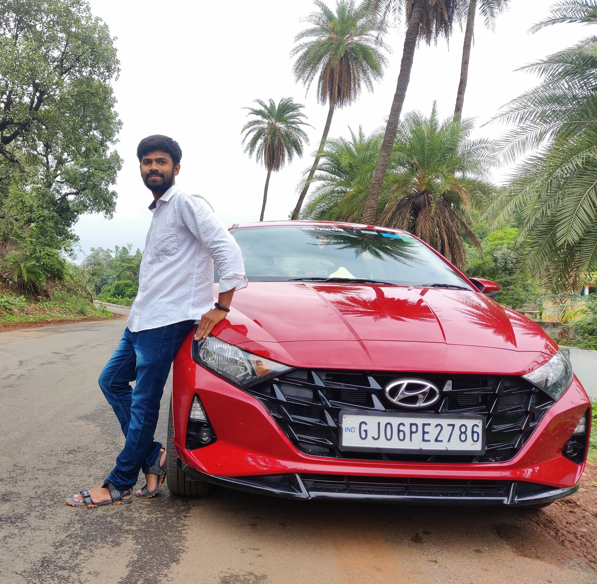
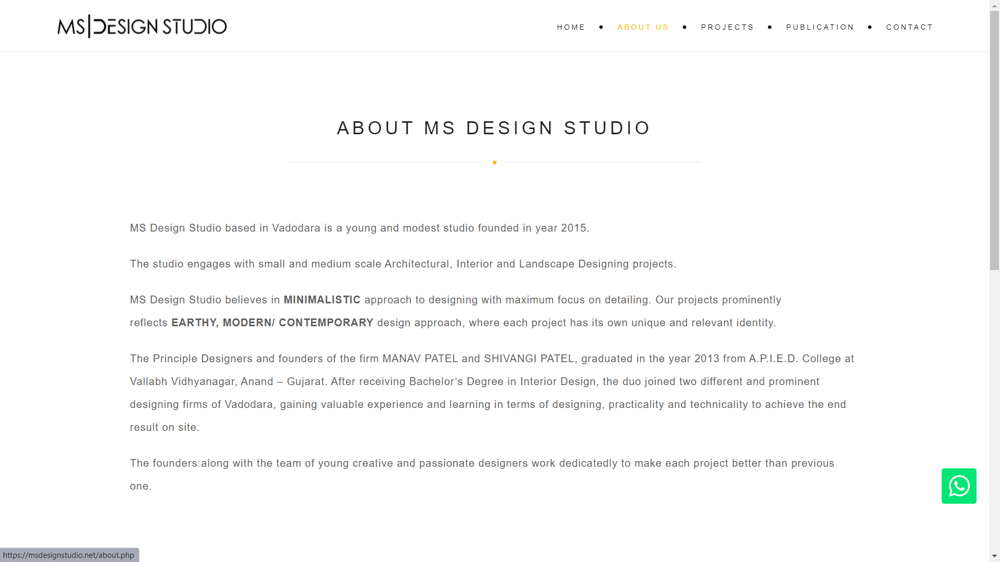
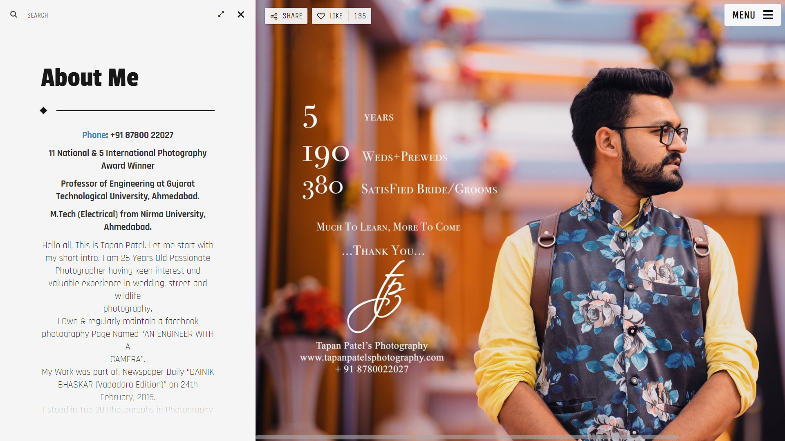
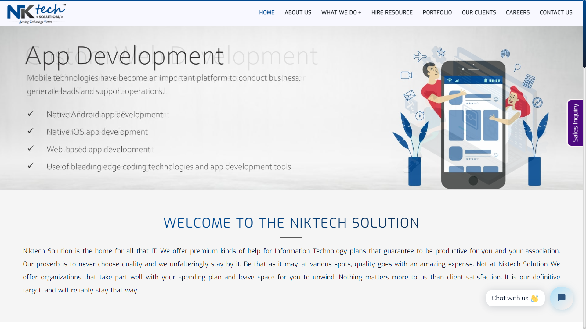
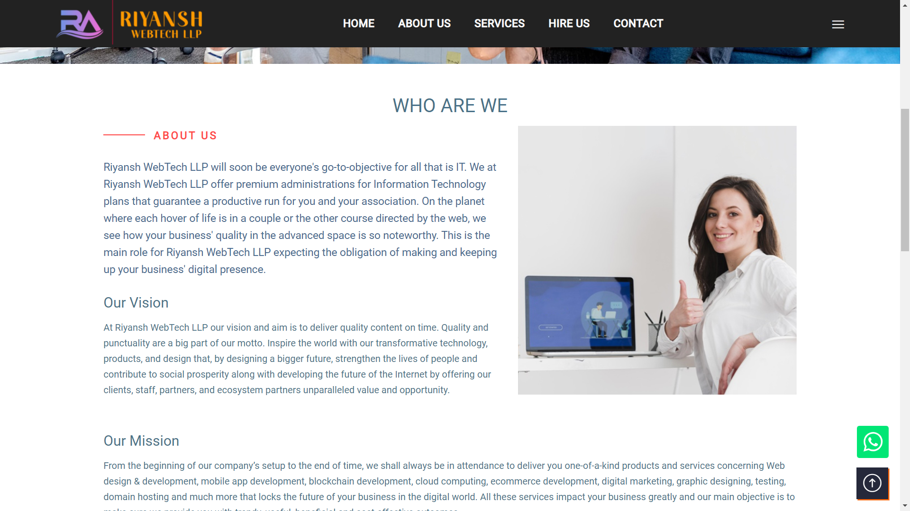
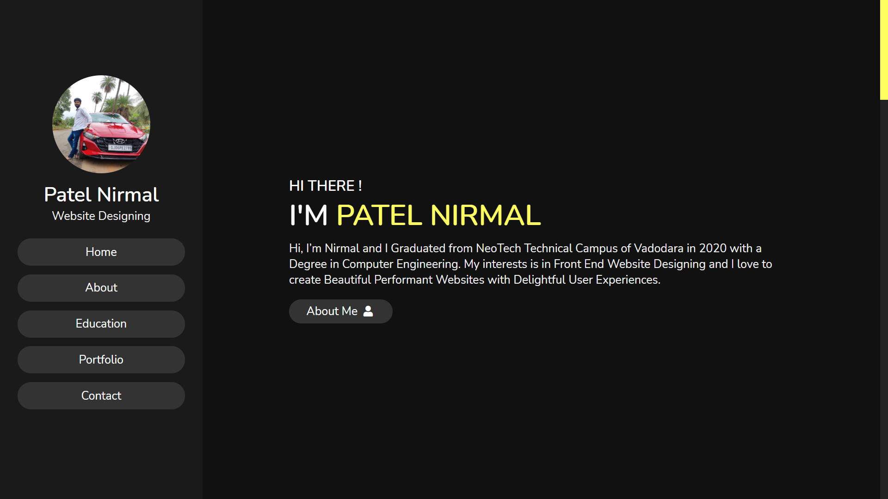
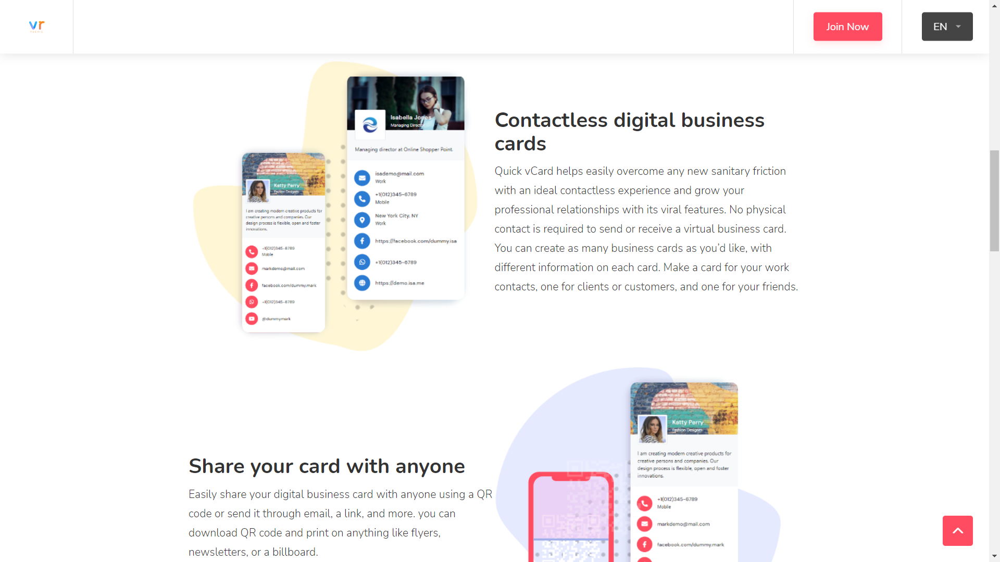

<head>
    <meta charset="UTF-8">
    <meta name="viewport" content="width=device-width, initial-scale=1.0">

    <link rel="icon" href="pic.png" type="image/x-icon">

    <!-- font awesome cdn link  -->
    <link rel="stylesheet" href="https://cdnjs.cloudflare.com/ajax/libs/font-awesome/5.15.2/css/all.min.css">

    <!-- custom css file link  -->
    <link rel="stylesheet" href="style.css">

</head>

<body>

    <!-- header section starts  -->

    <header>

        

            
            <h3 class="name">Patel Nirmal</h3>
            
Website Designing

        

        <nav class="navbar">
            <ul>
                <li><a href="#home">Home</a></li>
                <li><a href="#about">About</a></li>
                <li><a href="#education">Education</a></li>
                <li><a href="#portfolio">Portfolio</a></li>
                <li><a href="#contact">Contact</a></li>
            </ul>
        </nav>

    </header>

    <!-- header section ends -->

    

    <!-- home section starts  -->

    <section class="home" id="home">

        <h3>HI THERE !</h3>
        <h1>I'M PATEL NIRMAL</h1>
        
Hi, I’m Nirmal and I Graduated from NeoTech Technical Campus of Vadodara in 2020 with a Degree in Computer
            Engineering. My interests is in Front End Website Designing and I love to create Beautiful Performant
            Websites with Delightful User Experiences.

        <a href="#about"><button class="btn">About Me <i class="fas fa-user"></i></button></a>

    </section>

    <!-- home section ends -->

    <!-- about section starts  -->

    <section class="about" id="about">

        <h1 class="heading"> About Me </h1>

        

            

                <h3>  Name :  Patel Nirmal </h3>
                <h3>  Age :  22 Years Old </h3>
                <h3>  Qualification :  Bachelor </h3>
                <h3>  Post :  Website Designer </h3>
                <h3>  Language :  English, Gujrati, Hindi </h3>
                <a href="#"><button class="btn"> Download CV <i class="fas fa-download"></i> </button></a>
            

            

                

                    2+
                    <h3>Years of Experience</h3>
                

                

                    100+
                    <h3>Project Completed</h3>
                

                

                    430+
                    <h3>Happy Clients</h3>
                

                

                    20+
                    <h3>Awards Won</h3>
                

            

        

    </section>

    <!-- about section ends -->

    <!-- education section starts  -->

    <section class="education" id="education">

        <h1 class="heading"> My Education </h1>

        

            

                <i class="fas fa-graduation-cap"></i>
                2020
                <h3>Front End Designer</h3>
                
It is built using a modern web technology stack - HTML5, Bootstrap4, Css, Js, jquery webpack and is mobile-responsive.

            

            
            

                <i class="fas fa-graduation-cap"></i>
                2020
                <h3>BE in Computer Engineering</h3>
                
Neotech Technical Campus,
                    Vadodara,
                    Gujarat
                    

            

            

                <i class="fas fa-graduation-cap"></i>
                2019
                <h3>Tranie At Niktech Solution</h3>
                
One of the most experienced and trusted Web Design & Web Development Company in Vadodara. 

            

            

                <i class="fas fa-graduation-cap"></i>
                2018
                <h3>Android Studio</h3>
                
Android Studio is the official integrated development environment for Google's Android operating system, built on JetBrains' IntelliJ IDEA software and designed specifically for Android development.

            

        

            

                <i class="fas fa-graduation-cap"></i>
                2016
                <h3>HSC from GSEB</h3>
                
Saint Basil School,
                    Vadodara,
                    Gujarat
                    

            

            

                <i class="fas fa-graduation-cap"></i>
                2014
                <h3>SSC from GHSEB</h3>
                
Saint Basil School,
                    Vadodara,
                    Gujarat
                    

            

        

    </section>

    <!-- education section ends -->

    <!-- portfolio section starts  -->

    <section class="portfolio" id="portfolio">

        <h1 class="heading"> My Portfolio </h1>

        

            

                
            

            

                
            

            

                
            

            

                
            

            

                
            

            

                
            

        

    </section>

    <!-- portfolio section ends -->

    <!-- contact section starts  -->

    <section class="contact" id="contact">

        <h1 class="heading"> Contact Me </h1>

        

            

                <h3 class="title">contact info</h3>

                

                    <h3> <i class="fas fa-envelope"></i> patelnirmal1898@gmail.com </h3>
                    <h3> <i class="fas fa-phone"></i> +91 96629 63867 </h3>
                    <h3> <i class="fas fa-phone"></i> +91 95586 89874 </h3>
                    <h3> <i class="fas fa-map-marker-alt"></i> C-42, Pavitra Township,
                        Nr. Maneja Crossing,
                        Maneja, Vadodara, Gujarat
                         </h3>
                         
<label><b>Follow on:</b></label>
                            <a href="https://www.facebook.com/nirmal1898/"><i class="fab fa-facebook"></i></a>
                            <a href="https://twitter.com"><i class="fab fa-twitter"></i></a>
                            <a href="https://www.instagram.com/nirmal_3011/"><i class="fab fa-instagram"></i></a>
                            <a href="https://www.google.com"><i class="fab fa-google-plus"></i></a>
                        

                

            

            <form action="">

                <input type="text" placeholder="name" class="box">
                <input type="email" placeholder="email" class="box">
                <input type="text" placeholder="project" class="box">
                <textarea name="" id="" cols="30" rows="10" class="box message" placeholder="message"></textarea>
                <button type="submit" class="btn"> Send <i class="fas fa-paper-plane"></i> </button>

            </form>

        

    </section>

    <!-- contact section ends -->

    <!-- scroll top button  -->

    

    <!-- jquery cdn link  -->
    

    <!-- custom js file link  -->
    

</body>

</html>
